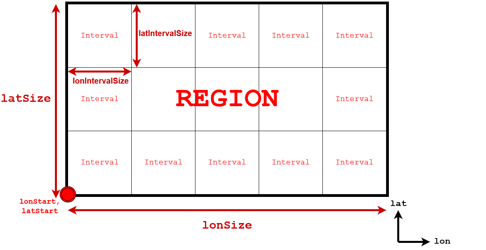
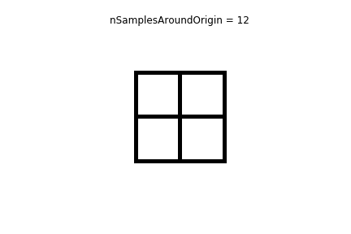
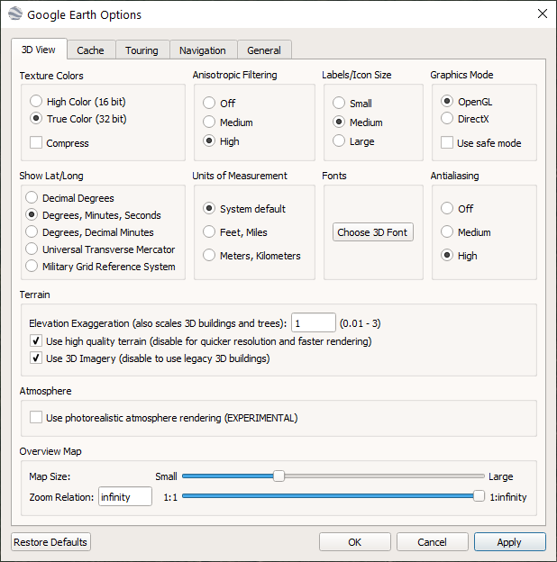
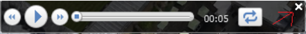
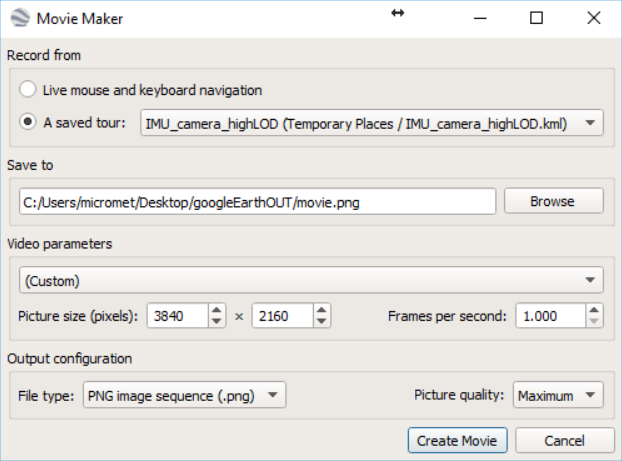
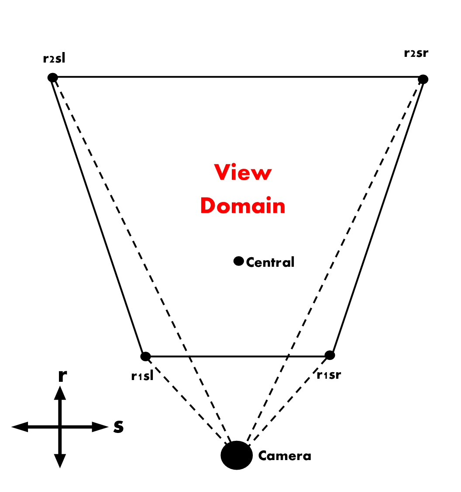
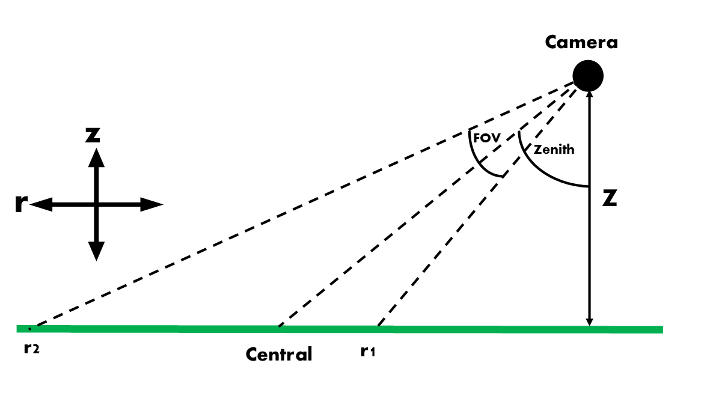

# googleEarthImageCollection

## Overview
* Automate the collection of Google Earth images for a specified area and using specified view angles.
* Handles Google Earth crashes and can automatically rerun after crash (experimental)
* Determination of camera viewing area, location and rotation 

### Definitions
* Region: The overall area that you want to get Google Earth images for
* Interval: The region is split into a regular grid of intervals
* Google Earth: Google Earth Pro *desktop version*

## Dependencies
This repo is not designed as a packaged "out of the box" working program. It is a collction of research scripts and little development time is spend making sure if works on the nth computer. The user will have to spend some time making sure all of the dependencies are met - sorry!
### OS:
 * Windows (tested on W10)
### Software:
 * Windows Powershell
 * Python 2.7
 * R 
 * Google Earth Pro desktop (tested on version 7.3.2.5776)
### Packages (with version used for testing):
 * Powershell: powershell-yaml
 * Python2.7: numpy (1.16.5), pandas (0.24.2), pyyaml (5.1.2), pykml (0.1.3), lxml (4.4.1), pyproj (1.9.6)
 * R: RCurl (1.98-1.1), RJSONIO (1.3-1.2), stringr (1.4.0), processx (3.4.1), ps (1.3.0), data.table (1.12.2)

_note other versions may also work (testing required)_

### Install python packages
Install pip with e.g.:
```
C:/Python27/python.exe get-pip.py
```
with get-pip.py found in this repository.

Make sure you have PROJ, get it via osgeo: http://download.osgeo.org/osgeo4w/osgeo4w-setup-x86_64.exe
Then install packages:
```
C:/Python27/Scripts/pip.exe install numpy==1.16.5 pandas==0.24.2 pyyaml==5.1.2 pykml==0.1.3 lxml==4.4.1 pyproj==1.9.6
 ```
 
### Install R packages
Install specific package versions like this:
```
devtools::install_version("RJSONIO", version = '1.3-1.2')
```

## Usage

### Install a region
Run install.bat to create a new directory structure to store images for a given region. These appear as a subdirectory in the *regions* folder.

| Directory | Description |
| --------- | ----------- |
| googleEarthOut | Google Earth images are saved here. Images are moved into subdirectories based the number of times google earth has been re-run e.g. if Google Earth crashes or is restarted by the user |
| imageInterval | Contains csv files with image meta data (camera location, rotation, view domain) |
| kmlFiles | Contains Google Earth 'tour' kml files as well as a folder containing view domain KMLs for every image, making it easy to see what the program has calculated the view domain to be. This includes both the height adjusted and non height adjusted view domains |
| LOG | powershell log files | 
| metaData | Contains imageCollectionConfig.yml. This file contains all program parameters. | 

### Edit imageCollectionConfig.yml
Define the directories to Python, R and Google Earth in the imageCollectionConfig.yml.

Define the Google Earth "tour" parameters: e.g. number of images, extent of the sample region.

| Parameter | Description | Units |
| --------- | ----------- | ----- |
| projection | The coordinate system that you are using to define your collection area. This should be in the form of a proj4 string, such as the default projection in imageCollectionConfig.yml | NA |
| latStart/lonStart | The UTM lat/lon coordinate for the bottom left corner of the full region. Might be useful to use https://epsg.io/map [or similar] to get an idea of the UTM coordinates needed. | m |
| latSize/lonSize |  The size of the region in lat/lon axis | m |
| latIntervalSize/lonIntervalSize | The region is split into latstep/lonstep intervals. Google Earth images are taken around the central point of each interval. If the latstep/lonstep is not divisble by total region area [latinterval/loninterval], the number of steps will be rounded up. | m |
| horizFov |  Horizontal field of view of Google Earth tour camera. | degrees | 
| range0 | Unsure of function- keep to zero [default] | No idea |
| altitudeMode | How the height of the camera is determined i.e. for absolute the camera height is measured from a height of zero as opposed to ground level. Best to keep default. | NA |
| lookAtDuration | How long does the Google Earth tour camera look at a given location? Default is 1 second. Only play with this if there are issues with google earth. Other elements of the program routine will need to be edited if this parameter is changed. E.g. if changing to 1s then you will need to run the google earth "movie" at 1 fps rather that 10 fps for 0.1s. Best to keep default. | seconds |
| zenithAngles | Zenith angle(s) of the camera. 0 degrees looks straight down at the center of each latstep/lonstep. Takes multiple inputs. Use in conjunction with multiple 'nSamplesAroundOrigin' and 'pathLengths' | degrees | 
| nSamplesAroundOrigin | For each latstep/lonstep, defines the number of images to be taken in equal azimuth angle steps around each zenithAngle. Use in conjunction with 'zenithAngles' and 'pathLengths' | NA |
| pathLengths | The path length between the camera and the center of the interval. Use in conjunction with 'zenithAngles' and 'nSamplesAroundOrigin'. | m |

The 'regionArea' parameters are shown diagramically below:


Images are collected by rotatating a camera around each interval 'nSamplesAroundOrigin' times. Once every image of one interval is collacted, the camera moves to the next, like this:



#### Using multiple zenith angles, path lengths and samples around origin
The parameters 'zenithAngles', 'nSamplesAroundOrigin' and 'pathLengths' **must all have the same number of inputs**. Multiple inputs are given to a parameter like so: 
```
cameraOptions:
   zenithAngles:
   - 0
   - 45
 ```
if you wanted to take images at zenith angles 0 and 45. Correspondingly, nSamplesAroundOrigin and pathLengths must also have 2 arguments in this scenario. For example if you had zenithAngles [0, 45], as above, nSamplesAroundOrigin [1, 10] and pathLengths [360, 260] the Google Earth tour will capture one image at 0 degrees from 360 metres and 10 images at 45 degrees from 260 metres. 

### Run imageCollection.PS1
Run imageCollection.PS1 to collect all required Google Earth images and calculate their view domains. imageCollection.PS1 creates the imageIntervalTable.csv file within the 'imageInterval' directory. This file contains information on the camera position of all images that will be created. A KML file is also generated that is automatically loaded into Google Earth. Using this KML, a sequence of images of the specified area can be created. 

#### Configure Google Earth

Some advised Google Earth settings:



Google Earth should automatically open when imageCollection.PS1 is run. Configure Google Earth by:
1. Clear and then maximise both caches [options.. -> tools -> options...] (with the buttons in the same window). 
2. Close the small time bar in the bottom left corner of the images displayed, by clicking on the small 'x': 
3. Go to 'Tools -> Movie Maker". 
4. The following window will appear:



5. You have to use the settings displayed:
 * Save images in the googleEarthOut subdirectory within the region directory you're working in
 * Make sure you select the right kml from the saved tour drop down menu. The tour kml will be called {your project name}_{number of times google earth has run}.kml
 * frames per second (fps) must correspond to the 'lookAtDuration' defined in the config yml file e.g. a look at duration of 0.1s corresponds to a fps of 10. 
 * It's recommended that a square picture size is use e.g. 2000 x 2000 pixels.
 * Maximum picture quality is recommended. 
6. Click "create movie"
7. If Googel Earth crashes, follow the powershell prompts (requires quotes e.g. type "y" not y, see issue #8). 

## Close Google Earth
Once the tour and image capture has finished, close Google Earth and follow the powershell prompts.

## Output files

### googleEarthOut
Stores the raw output images from Google Earth. They are sorted into *n* subdirectories (googleEarthOut\run*n*), where *n* is the number of times Google Earth was restarted. This is needed because once Google Earth is restarted, the image number always starts from zero. The first image from the first run is
```
googleEarthOut\run0\movie-000000.png
```
The first image from the second run is 
```
googleEarthOut\run1\movie-000000.png
```
etc.

### imageInterval/imageIntervalTable.csv
This is the original table created by the programme showing every camera position it plans to take a picture from. Column meanings are defined below.

### imageInterval/imageViewDomains.csv
This file contains information about each image collected from google earth. The columns have the following meanings:

| Header(s) | Description |
| ------ | ----------- |
| Z, X, Y | The height above ground, X and Y positions of the camera. | 
| Zenith, azimuth | The zenith and azimuth angles of the camera. |
| Roll | Roll of the camera. |
| Z_ground | The height of the ground at the centre of the interval the camera is looking at. |
| IntervalCentre | The central point of the interval that the camera is focussed on, and the height of this point above sea level [x, y, z]. |
| Created | A reference column used by the program. |
| intervalNo | The interval number. |
| Label, run | The name of the image and which 'run' it was created. |
| central, r1sl, r2sl, r1sr, r1sl | The coordinates and above sea level height of the central point, lower left, upper left, lower right and upper right of the image. See below for more details. |
| r1sl_adjusted, r2sl_adjusted, r1sr_adjusted, r1sl_adjusted | As above but after making an adjustment for height. |
| topography_flag | 0 or 1. 0 means no complex topography has been detected and 1 means complex topography has been detected. In this case the calculated view domain of the image is likely to be innacurrate. The user should consider taking a higher density of images if complex terrain is present. |

## Further details

## Image source area calculation
The image source area is calculated to give a representation of the ground area observed by each camera. There are five points of interest with the camera source area. The `central` point is along the camera axis. The other points are `r1sl`, `r1sr`, `r2sr`, `r2sl`. See figures below for where these points lie on the image source area.  



- The source area accounts for orography using the following steps:
  1. Get the height of each source area point from the google maps api 
  2. For each point, create a 2D plane that intersects the point and the two points adjacent to it (e.g. for r1sl the plane will be calculated using the coordinates of r1sl, r1sr and r2sl).
  3. then, the point of intersection between this plane and the line from the camera to the point gives a height adjusted point (rNsD_adjusted).
- **This height correction is not accurate in complex terrain.** This is the reason a 'topography flag' is given in these situations. This is derived by finding the height difference between height of the central point given by the google maps API and the theoretical height derived by calculating the height the central point would have if it was on each of the planes. If the difference is greater than 15m for all planes the land surface is considered non-planar enough such that the adjusted view domain calculation will be significantly affected. in this situation the user is reccomended to take more images of the area.
- All this imformation can be found in viewDomains.csv in the 'imageInterval' directory. 

