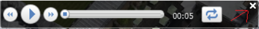
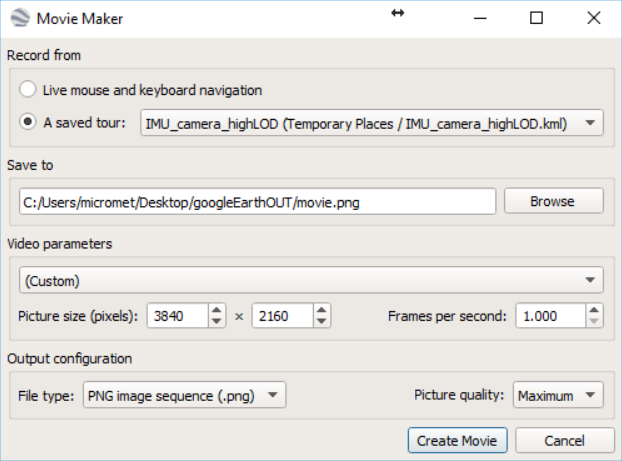
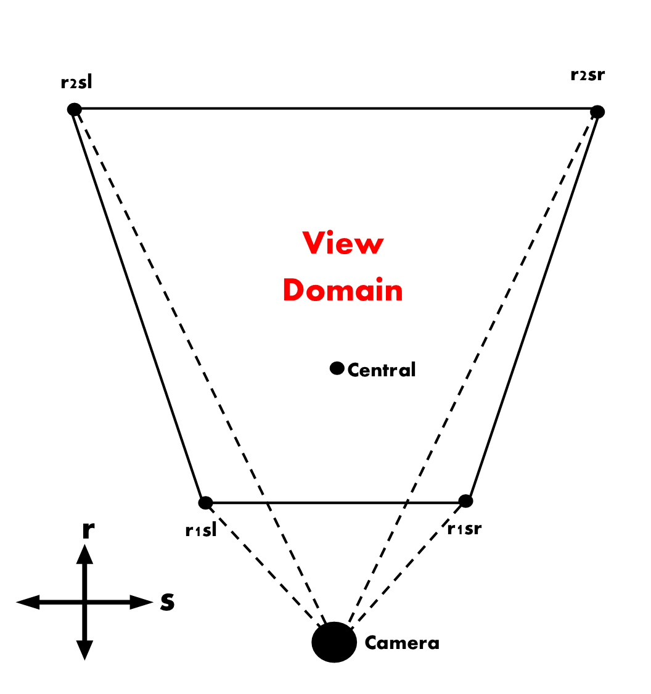
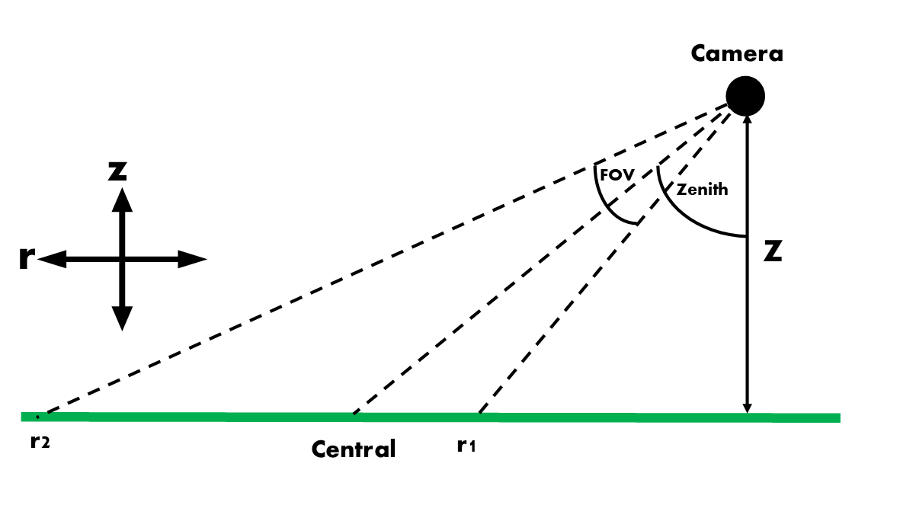

# googleEarthImageCollection
Collect images from Google Earth that can be used to generate 3-D models.
---

## Features
* Collect images from Google Earth for a specified area and using specified view angles.
* If Google Earth crashes, Google Earth will restart from the point of the crash.
* Viewing domain, or source area, of each image is calculated. 

## Dependencies
### OS:
     * Windows (tested on W10)
### Software:
     * Windows Powershell
     * Python 2.7
     * R 
     * Google Earth Pro
### Packages:
     * Powershell: powershell-yaml
     * Python2.7: numpy, pandas, pyyaml, pykml, lxml, pyproj
     * R: RCurl, RJSONIO
     
### Install python packages
Install pip with e.g.:
```
C:/Python27/python.exe get-pip.py
```
with get-pip.py found in this repository.

Make sure you have PROJ, get it via osgeo: http://download.osgeo.org/osgeo4w/osgeo4w-setup-x86_64.exe
Then install packages:

```
C:/Python27/Scripts/pip.exe install numpy pandas pyyaml pykml lxml pyproj
 ```
 
### Install R packages
Open R and type:
```
install.packages(c("RCurl", "RJSONIO"))
```

## Usage
Create a new directory structure to store images for a given region. Run install.bat to create the directories. These appear as a subdirectory in the *simulations* folder.

### Edit imageCollectionConfig.yml
Configure your collection region and other parameters- such as the directories to Python, R and Google Earth in the imageCollectionConfig.yml. This is in YAML format.
Put the imageCollectionConfig.yml table here

### Configure Google Earth
Put the steps to configure google earth here

### Run imageCollection.PS1
Run imageCollection.PS1 to collect all required Google Earth images and calculate their view domains.
Describe quickly what goes on during the processing

## Furhter details
### Source area calculation
### other details

Anything below here should be put in the appropriate art of "Usage" and "Further details" secion
### A. image collection
- The meta data for the collection, such as the collection area, for the Google Earth image collection is defined in the imageCollectionConfig.yml file within the 'metaData' directory.   
- After configuring the image collection, imageCollection.PS1 is run. Firstly, this will create the imageIntervalTable.csv file within the 'imageInterval' directory. This file contains information on the camera position of all images that will be created, given the meta data provided.
- A KML file is also generated that is automatically loaded into Google Earth. Using this KML, a sequence of images of the specified area can be created. 
- This is done using the following steps:
   1. In Google Earth, make sure caches are maximum possible [options.. -> tools -> options...] and clear both caches (with the buttons in the same window). 
   2. Close the small time bar in the bottom left corner of the images displayed, by clicking on the small 'x': 
   3. Then you would be able to go to 'Tools -> Movie Maker". 
   4. The following window will appear:
   
   5. You have to use the settings displayed:
      * **You must save images in the googleEarthOut subdirectory within the region directory you're working in**
      * Make sure you select the right kml from the saved tour drop down menu. The tour kml will be called {your project name}_{number of times google earth has run}.kml
      * frames per second (fps) must correspond to the 'lookAtDuration' defined in the config yml file e.g. a look at duration of 0.1s corresponds to a fps of 10. 
      * It's recommended that a square picture size is use e.g. 2000 x 2000 pixels.
      * Maximum picture quality is recommended. 
     
   6. Click 'create movie' to start the tour.  
- When google earth is quit, crashes or timesout, the user is asked whether the image collection had finished. At this point the user must answer 'y' or 'n' acordingly. If yes then google earth of re-opened with a new KML loaded, picking up where the previous left off. This will keep happening until all images are created or the user specifies 'n'.
- If powershell is quit or fails during the image collection then imageCollection.PS1 will try an identify where to restart the program and ask the user whether to restart here or start. 
- Images are stored in the 'googleEarthOut' directory and then in a sub-directory created depending on which time google earth was run (i.e. run0 is the first time google earth was opened, run1 the second ect). Also within the sub-directory is the imageIntervalTable_runN.csv file which corresponds each image to a camera position.

### B. getting the view domain of each image 
- The next step is to calculate an idealised view domain. This is the area that would be covered by the image if the camera was looking at a perfectly flat area at sea level. This is calculated using trigonometry. The points of the view domain are: Central is the point the camera is focussed on. The other points that encapsule the view domain are r1sl, r1sr, r2sr, r2sl. To understand what these mean consider r to be in the direction away from the camera (1 being closer than 2) and s to be the direction perpendicular to the camera (r and l being right and left respectively). See figures below for visual representations of this.  



- As these points are based on an idealised situation they are generally not accurate in the real world. Therefore, a height correction must be made. This is done using the following steps:
  1. Get the height of each point from the google maps api 
  2. For each point, create a 2D plane that intersects the point and the two points adjacent to it (e.g. for r1sl the plane will be calculated using the coordinates of r1sl, r1sr and r2sl).
  3. then, the point of intersection between this plane and the line from the camera to the point gives a height adjusted point (rNsD_adjusted).
- **This height correction is not accurate in complex terrain.** This is the reason a 'topography flag' is given in these situations. This is derived by finding the height difference between height of the central point given by the google maps API and the theoretical height derived by calculating the height the central point would have if it was on each of the planes. If the difference is greater than 15m for all planes the land surface is considered non-planar enough such that the adjusted view domain calculation will be significantly affected. in this situation the user is reccomended to take more images of the area.
- All this imformation can be found in viewDomains.csv in the 'imageInterval' directory. 

## Directory navigation
| Directory | Description |
| --------- | ----------- |
| googleEarthOut | Where images are saved from google earth. Images are then moved into subdirectories based the number of times google earth has been re-run i.e. how many times it has crashed or been closed by the user. |
| imageInterval | Where csv files files containing information on each image such as where the camera is located and the view domain of the image. |
| kmlFiles | kml files of the google earth 'tour' as well as a folder containing view domain KMLs for every image, making it easy to see what the program has calculated the view domain to be. This includes both the height adjusted and non height adjusted view domains. |
| LOG | powershell transcript text files stored here | 
| metaData | imageCollectionConfig.yml is stored here -> this is where you define the area of your region. | 


## Configuration parameters
All of these are parameters that define the area that is collected and how the images will appear.

| Parameter | Description | Units |
| --------- | ----------- | ----- |
| projection | The coordinate system that you are using to define your collection area. This should be in the form of a proj4 string, such as the default projection in imageCollectionConfig.yml | NA |
|  Latstart/Lonstart | The UTM lat/lon coordinate for the bottom left corner of the full domain. Might be useful to use https://epsg.io/map [or similar] to get an idea of the UTM coordinates needed. | m |
|  latinterval/loninterval |  The size of the domain in lat/lon axis | m |
|  latstep/lonstep | The resolution of each interval in lon/lat axis. The distance is measured from the XY center of each interval. If the step is not divisble by the interval [latinterval/loninterval], the number of steps will be rounded up. | m |
| horizFov |  Horizontal field of view of google earth tour camera. | degrees | 
| range0 | Unsure of function- keep to zero [default] | No idea |
| altitudeMode | How the height of the camera is determined i.e. for absolute the camera height is measured from a height of zero as opposed to ground level | NA |
| lookAtDuration |  How long does the google earth tour camera look at a given location? Default is 1 second. Only play with this if there are issues with google earth. Other elements of the program routine will need to be edited if this parameter is changed. E.g. if changing to 1s then you will need to run the google earth "movie" at 1 fps rather that 10 fps for 0.1s . | seconds |
| zenithAngles | Zenith angles of the camera. Takes multiple inputs. Use in conjunction with multiple 'nSamplesAroundOrigin' and 'pathLengths' | degrees | 
| nSamplesAroundOrigin | number of images to be taken around each zenithAngle. Use in conjunction with multiple 'zenithAngles' and 'pathLengths'| NA |
| pathLengths | The path length between the camera and the center of the chunk. The center of the chunk is adjusted to be above sea level. Use in conjunction with 'zenithAngles' and 'nSamplesAroundOrigin' | m |

#### Using multiple zenith angles, path lengths and samples around origin
The parameters 'zenithAngles', 'nSamplesAroundOrigin' and 'pathLengths' **must all have the same number of inputs**. Multiple inputs are given to a parameter like so: 
```
cameraOptions:
   zenithAngles:
   - 0
   - 45
 ```
 If you wanted to take images at zenith angles 0 and 45. Correspondingly, nSamplesAroundOrigin and pathLengths must also have 2 arguments in this scenario. For example if you had zenithAngles [0, 45], as above,  nSamplesAroundOrigin [1, 10] and pathLengths [360, 260] you would have one image at 0 degrees from 360 metres and 10 at 45 degrees from 260 metres. 
